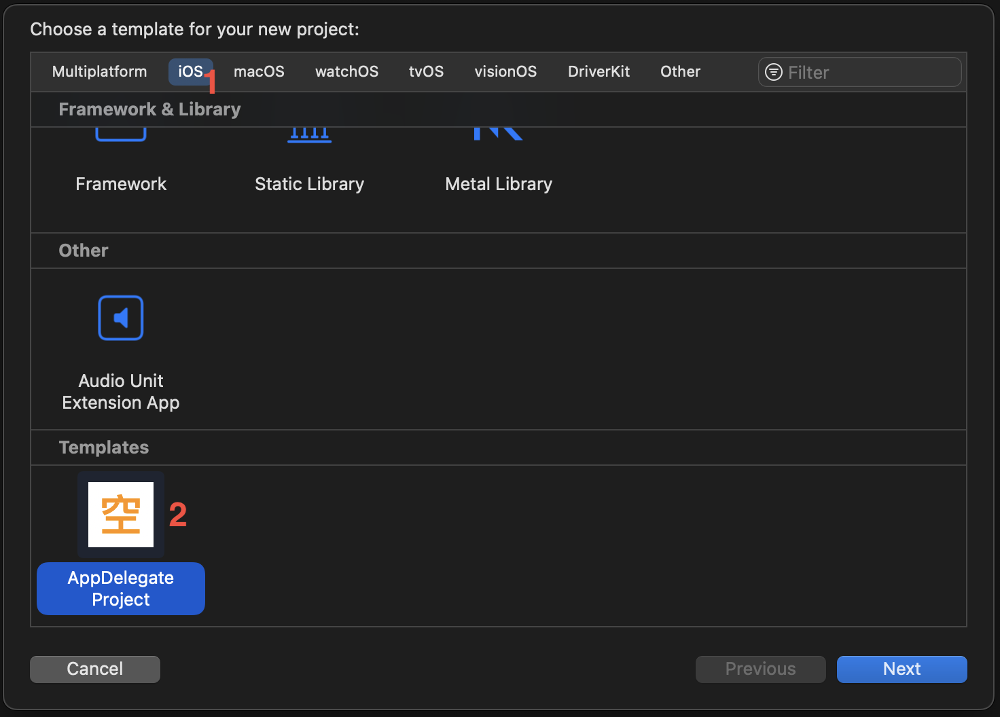

Title: AppDelegate Template  
分類: Xcode  

## 前言

目前創建 iOS App 都是使用 SceneDelegate Life Cycle, 少數公司還是會要求使用 AppDelegate,  
所以創建了 AppDelegate Life Cycle Template

## 使用方法

下載[最新版本][L1] Template.zip, 解壓縮後將 `AppDelegate Project.xctemplate` 移動到目錄之下, 如果目錄不存在, 請自行創建.

```
~/Library/Developer/Xcode/Templates
```

開啟 Xcode -> New Project, 選取 iOS 分類滑動到最下方, 就會找到 Template, 然後創建專案.



## 注意事項

Template 僅會創建 AppDelegate.swift 跟最簡單的 Source, 必須手動創建其他步驟.

1. 在 AppDelegate.swift 設置 window.rootViewController  
2. 另外必須手動設定 Launch Screen, 不然 App 會上下黑邊


[L1]: https://github.com/shinrenpan/AppDelegate-Template/releases/latest/
